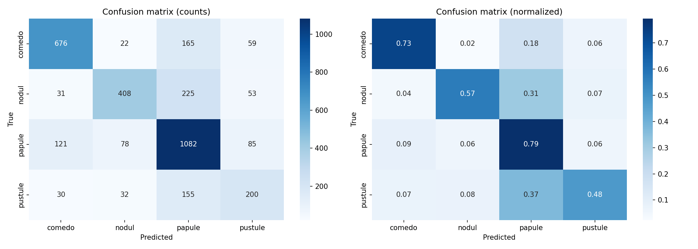

# Antrenare Modele - Prin Google Colab

Acest director conține scripturile și experimentele de antrenament pentru modelele de detecție, rulate în mediul Google Colab. Fișierul principal, `Antrenare_YOLO_+_EfficientDet.ipynb`, prezintă antrenamentele pentru arhitecturile YOLOv8m și EfficientDet-D1.

---

### Selecția Arhitecturii și a Rezoluției

Experimentele inițiale au comparat două arhitecturi de referință în condiții de antrenare echivalente (același set de date, rezoluție de 640px, 150 de epoci cu oprire timpurie):

- **YOLOv8m** a obținut rezultate superioare, depășind EfficientDet-D1 cu 5.0 puncte procentuale la metrica mAP@0.5 (0.231 vs 0.181).
- **Selecția rezoluției:** Deși majoritatea imaginilor din setul de date aveau o rezoluție nativă sub 640px, antrenarea la 640px a oferit o localizare mult mai precisă a ferestrelor comparativ cu 416px, aspect critic pentru etapa ulterioară de clasificare.

---

### Studiu de Ablații - YOLOv8m Multiclass

Pentru a optimiza performanța modelului de referință YOLOv8m la 640px, a fost realizat un studiu de ablații vizând dezechilibrul claselor, tehnicile de augmentare și scara de antrenare:

1. **Tratarea dezechilibrului claselor (`cls_pw = 0.5`)**
   S-a ajustat parametrul `cls_pw` pentru a penaliza clasele majoritare (Papulă) și a spori importanța celor minoritare (Pustulă, Nodul). Această modificare a crescut recall-ul pentru clasele minoritare, oferind o corecție parțială adecvată dezechilibrului din dataset.

2. **Strategii de Augmentare**
   Au fost comparate două abordări:
    - **Augmentarea nativă YOLO:** Folosirea tehnicilor interne de mosaic, mixup și copy-paste.
    - **Augmentarea propusă (Algoritm offline):** Utilizarea scriptului din directorul "Augmentare Script", care inserează leziuni minoritare pe o mască facială bazată pe spațiul YCrCb. Această abordare s-a confruntat cu un grad de supraadaptare la antrenament comparativ cu augmentarea nativă.

3. **Antrenament multi-scară (`multi_scale = 0.5`)**
   La fiecare batch de antrenare, s-a selectat aleatoriu o rezoluție din intervalul [320, 960] px (multiplu de 32). Această tehnică expune modelul la obiecte de dimensiuni variate.

**Configurația Finală:**
Configurația câștigătoare pe setul de validare combină antrenamentul multi-scară cu ponderarea claselor (`multi_scale = 0.5` + `cls_pw = 0.5`), obținând cel mai bun mAP@0.5 (0.245).

## 2. Modelul de Clasificare: EfficientNet-B0

Pentru etapa de clasificare a leziunilor, a fost utilizată arhitectura **EfficientNet-B0** ($\approx 4$M parametri). Pregătirea datelor, mai exact extragerea bounding box-urilor (ferestrelor) necesare pentru antrenarea acestui model, se realizează folosind scriptul `Extragere Bounding Boxes/script_extragere_bb_224.py`.

### Detalii de Antrenare și Augmentare

- **Parametri antrenare:** Modelul a fost antrenat pe un număr maxim de 40 de epoci, utilizând o dimensiune a batch-ului de 128. S-a implementat mecanismul de oprire timpurie (early stopping) cu o răbdare de 8 epoci.
- **Performanță:** Cea mai bună acuratețe pe setul de validare ($0.649$) a fost atinsă la epoca 9, procesul de antrenare oprindu-se automat la epoca 17.
- **Augmentare date:** Pentru a preveni supraadaptarea și a spori generalizarea, au fost aplicate următoarele tehnici în timpul antrenamentului: oglindire orizontală și verticală, rotații ($\pm 30^\circ$), variații de luminozitate, contrast, saturație și nuanță, precum și ștergerea aleatoare de regiuni (random erasing).

### Tratarea Dezechilibrului Claselor

Dezechilibrul claselor din setul de date a fost abordat printr-o tehnică de reeșantionare ponderată (_WeightedRandomSampler_). La construirea fiecărui batch, exemplele sunt extrase cu probabilități proporționale cu:

$$p = \left(\frac{1}{f_c}\right)^{\alpha}$$

unde $f_c$ reprezintă frecvența clasei respective în setul de date. S-a selectat exponentul $\alpha = 1.0$ pentru a asigura o corecție completă a dezechilibrului, permițând astfel ca instanțele din clasele rare să apară mai des în timpul antrenamentului.

Matricea de confuzie obținută pe setul de validare pentru modelul EfficientNet-B0 este prezentată mai jos:

## 3. Optimizarea Pragurilor de Inferență (Grid Search)

Fișierul `Grid_Search_+_Evaluare_YOLO_Multiclass.ipynb` detaliază procesul de optimizare a parametrilor de inferență pentru obținerea celui mai bun punct de operare pe modelele antrenate.

La momentul inferenței, detecțiile sunt filtrate pe baza a doi parametri critici:

- **`conf` (pragul de încredere):** Un prag mai mic crește recall-ul, însă permite păstrarea unui număr mai mare de detecții false pozitive.
- **`iou_NMS` (pragul IoU pentru Non-Maximum Suppression):** Elimină ferestrele duplicate ale aceleiași leziuni, păstrând-o exclusiv pe cea cu scorul cel mai mare.

### Metodologia de Căutare

Cei doi parametri au fost optimizați independent pentru fiecare model printr-o căutare exhaustivă (Grid Search) pe $9 \times 9 = 81$ de configurații, realizată exclusiv pe setul de validare:

- $\texttt{conf} \in \{0.01, 0.05, 0.10, 0.15, 0.20, 0.25, 0.30, 0.35, 0.40\}$
- $\texttt{iou\_NMS} \in \{0.10, 0.20, 0.30, 0.40, 0.45, 0.50, 0.55, 0.60, 0.70\}$

Criteriul de selecție a fost maximizarea mediei armonice $F_1$, o metrică potrivită pentru stabilirea unui punct de operare fix, deoarece echilibrează precizia și recall-ul:

$$F_1 = \frac{2 \cdot P \cdot R}{P + R}$$

### Configurații Optime și Rezultate

În urma optimizării pe setul de validare, au fost determinate configurațiile ideale. Mai jos sunt prezentate cele mai performante 5 configurații pentru ambele sisteme, ordonate după scorul $F_1$:

#### Top 5 Configurații - Detector Multiclasă

|   conf   | iou_NMS  | Precizie (P) | Recall (R) |      F1      | mAP@0.5  | mAP@0.5:0.95 |
| :------: | :------: | :----------: | :--------: | :----------: | :------: | :----------: |
| **0.01** | **0.30** |   0.352655   |  0.329883  | **0.340889** | 0.249751 |   0.084283   |
|   0.05   |   0.30   |   0.352655   |  0.329883  |   0.340889   | 0.224164 |   0.076275   |
|   0.05   |   0.40   |   0.351096   |  0.331147  |   0.340830   | 0.225227 |   0.076818   |
|   0.01   |   0.40   |   0.351096   |  0.331147  |   0.340830   | 0.253165 |   0.085671   |
|   0.01   |   0.10   |   0.354092   |  0.328017  |   0.340556   | 0.244957 |   0.082792   |

#### Top 5 Configurații - Sistem Secvențial (Pipeline)

|   conf   | iou_NMS  | Precizie (P) | Recall (R) |      F1      | mAP@0.5  | mAP@0.5:0.95 |
| :------: | :------: | :----------: | :--------: | :----------: | :------: | :----------: |
| **0.15** | **0.45** |   0.291157   |  0.301006  | **0.291538** | 0.154013 |   0.052792   |
|   0.15   |   0.40   |   0.294456   |  0.297417  |   0.291408   | 0.153062 |   0.052452   |
|   0.15   |   0.30   |   0.297423   |  0.294495  |   0.291393   | 0.152108 |   0.052109   |
|   0.15   |   0.50   |   0.285953   |  0.305307  |   0.290923   | 0.155051 |   0.053278   |
|   0.20   |   0.40   |   0.343078   |  0.258620  |   0.290894   | 0.139693 |   0.048188   |
