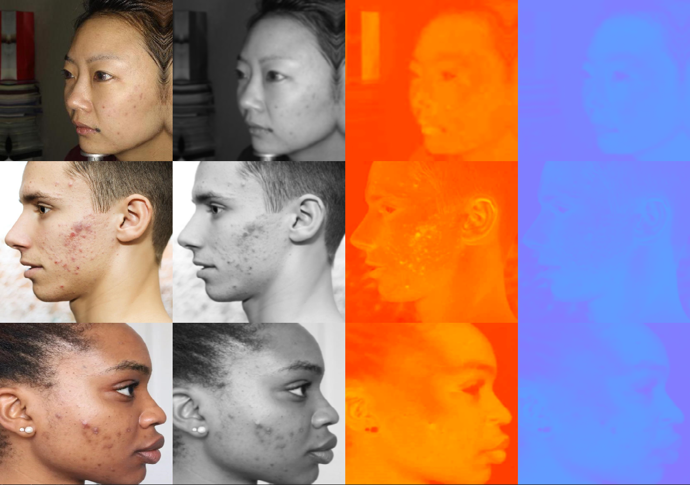

# Script de Augmentare pentru Leziuni Acneice

Acesti algoritmi reprezintă o soluție avansată de procesare a imaginilor și augmentare a datelor, dezvoltată pentru a îmbunătăți seturile de date medicale destinate antrenării modelelor de detecție a obiectelor (ex: YOLO). Sistemul se concentrează pe detectarea automată a pielii și inserarea realistă a unor noi leziuni (noduli, pustule, comedoane) pentru a echilibra clasele minoritare din dataset.

---

## Prezentarea Vizuală a Procesului

Procesul de augmentare se desfășoară în două etape vizuale principale, ilustrate în imaginile de prezentare:

### 1. Extragerea Feței (Masca Binară)

Utilizarea spațiului de culoare YCrCb în defavoarea formatului standard BGR este motivată de robustețea acestuia la variațiile de iluminare și la diversitatea fototipurilor umane. În spațiul YCrCb, informația de intensitate luminoasă (canalul Y) este decuplată de informația de culoare (canalele de crominanță Cr și Cb). După cum se poate observa în figura: `poze_fete.png`, deși cei trei subiecți prezintă fototipuri distincte ale pielii, distribuția valorilor în canalele Cr și Cb rămâne relativ constantă (invariantă).

În prima fază, este esențial să identificăm exact unde este pielea feței:

- **Imagini de referință:** `Poza 1 masca faciala.png` și `Poza 2 masca faciala.png`
  
  

- **Cum funcționează:** Se folosește spațiul de culoare **YCrCb** și filtrare dinamică pe baza medianei regiunii centrale. Astfel, algoritmul extrage fața subiectului printr-o **mască binară**.
- **Rezultatul:** Zona albă reprezintă pielea detectată (regiunea de lucru permisă), iar zona neagră reprezintă elementele ignorate.

### 2. Adăugarea Inteligentă a Leziunilor (Patch-uri)

Odată masca definită, urmează integrarea noilor leziuni, ținând cont de anatomia existentă. Leziunile au fost extrase folosind scriptul `Extragere Bounding Boxes/extragere_bb.py`

- **Imagini de referință:** `Poza 1 masca faciala + adaugare patch.png` și `Poza 2 masca faciala + adaugare patch.png`
  
  
- **Cum funcționează:** 1. Se citesc etichetele originale YOLO (leziunile pe care pacientul le are deja). 2. Acestea sunt decupate din masca pielii și transformate în **zone interzise** (pătratele negre vizibile în panoul din mijloc). 3. Se aleg "patch-uri" aleatorii (leziuni noi din alte imagini), se redimensionează și se aplică funcția de blending `cv2.seamlessClone`.
- **Rezultatul:** Leziunile sunt îmbinate perfect cu textura și culoarea pielii pacientului, fără coliziuni cu acneea preexistentă. În panoul din dreapta, leziunile adăugate sunt evidențiate cu cercuri colorate.

---

## Structura Folderului (Fișiere Python)

Proiectul este compus din 3 scripturi principale, fiecare având un rol bine definit în pipeline:

### 1. `program_vizualizare_masca_piele.py`

- **Rol:** Modul de depanare și vizualizare pentru algoritmul de detectare a pielii.
- **Descriere:** Acest script procesează imaginile din directorul de antrenament și afișează side-by-side imaginea originală și masca binară generată. Este util pentru a calibra parametrii de morfologie matematică (eroziune/dilatare) și pragurile de culoare.

### 2. `vizualizare_adaugare_leziune.py`

- **Rol:** Debugger vizual interactiv pentru algoritmul de augmentare.
- **Descriere:** Afișează procesul în 3 pași: imaginea originală cu zonele interzise (chenare roșii), masca de lucru actualizată (unde zonele interzise sunt decupate) și rezultatul final clonat. Permite verificarea vizuală a modului în care algoritmul selectează centrele valide pentru inserarea peticelor.

### 3. `adaugare patch.py`

- **Rol:** **Scriptul principal de augmentare**
- **Descriere:** Rulează peste tot dataset-ul de antrenament. Generează pentru fiecare imagine 2 variante augmentate. Pe lângă salvarea noilor imagini, acest script calculează noile coordonate (bounding boxes) și actualizează în mod automat fișierele text cu etichetele în format YOLO (`.txt`).

---

## Tehnologii și Dependințe

Proiectul folosește următoarele librării standard:

- `OpenCV (cv2)` - Pentru filtrare de culoare, operații morfologice și Seamless Cloning.
- `Numpy` - Pentru manipularea matricelor și calculele logice pe măștile binare.
- `OS` & `Pathlib` - Pentru manipularea căilor de fișiere și iterarea prin dataset.

## Cum se utilizează

1. Asigură-te că imaginile și etichetele sunt în directoarele corespunzătoare (`train/images` și `train/labels`).
2. Populează folderele de patch-uri minoritare (`patches_minoritare_nodul`, etc.) cu decupaje de leziuni valide.
3. Rulează `adaugare patch.py` pentru a genera automat noile date în folderul `./augmented`.
   README.md
   Se afișează README.md.
